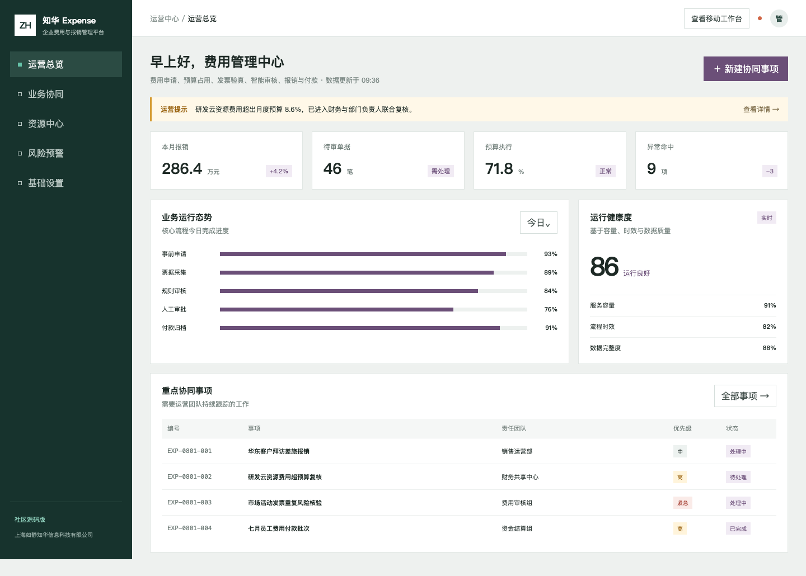
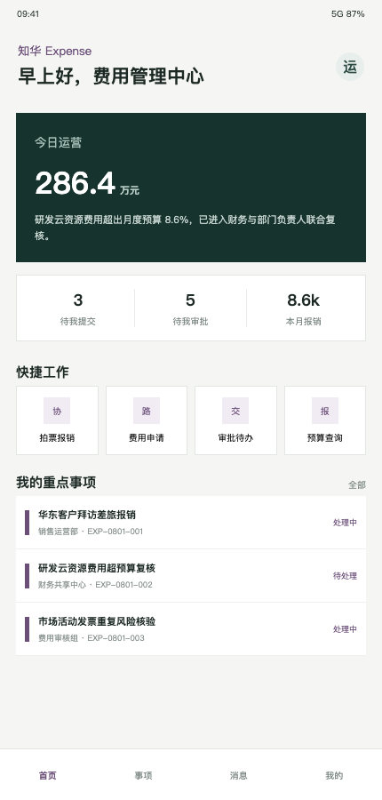

<div align="center">

# ZhuaTech Expense

**知华企业费用与报销管理平台 · 个人非商业社区源码版**

[官网](https://www.zhuatech.cn/)　·　[产品能力](#产品能力)　·　[体验工程](#体验工程)　·　[许可与合作](#许可与合作)

</div>

## 企业级增强：报销付款放行治理

新增票据、重复风险、费用政策、预算、职责分离、员工借款和双重审批联合校验，详见 [报销付款放行治理](docs/ENTERPRISE_REIMBURSEMENT_RELEASE.md)。

## 一笔费用如何完成合规闭环

`事前申请 → 预算占用 → 票据采集 → 规则预审 → 负责人/财务审批 → 付款归档`

ZhuaTech Expense 围绕这条链路提供可运行的前后端分离样例，适合学习企业费控、审批协同、风险规则与移动报销界面。项目由知华科技（上海如静知华信息科技有限公司）维护。



## 产品能力

| 工作台 | 展示与操作 |
| --- | --- |
| 财务管理端 | 本月费用、审批积压、预算执行、异常命中和付款事项 |
| 员工移动端 | 拍票报销、费用申请、审批待办、预算查询 |
| 合规规则 | 票据覆盖、费用超标、重复匹配、成本中心和事前审批 |
| 系统治理 | 角色隔离、输入校验、演示数据、测试与部署文档 |



核心预审接口：

```http
POST /api/admin/expense-compliance
```

返回风险分数、`PASS / MANUAL_REVIEW / REJECT` 决策和可解释原因。规则仅供软件学习演示，不替代企业财务制度、税务判断或人工审核。

## 体验工程

技术栈：Java 21、Spring Boot 4、Spring Security、Spring Data JPA、MySQL、Vue 3、Vite、Docker Compose。

```bash
cp .env.example .env
docker compose up --build
```

浏览器访问 `http://localhost:8090`。演示账号：`admin / admin123`、`operator / operator123`；请勿将默认凭据用于联网环境。进一步阅读 [API 文档](docs/API.md)、[架构设计](docs/ARCHITECTURE.md) 和 [贡献指南](CONTRIBUTING.md)。

## 许可与合作

版权所有 © 2026 上海如静知华信息科技有限公司。

本项目采用 ZhuaTech Community Source License 1.0（个人非商业版），仅允许个人非商业学习、研究、交流和修改。未经书面授权，不得用于企业生产、商业部署、SaaS、收费下载、培训、外包交付、投标、销售、品牌替换或任何直接/间接商业活动。本项目不是 OSI 认可的开源软件，完整条款以 [LICENSE](LICENSE) 为准。

需要商业授权、ERP/预算/发票/银企直联集成、私有化部署或深度定制，请访问知华科技官网 [https://www.zhuatech.cn/](https://www.zhuatech.cn/)，或扫描任一微信二维码咨询。

<p align="center">
  
  &nbsp;&nbsp;&nbsp;&nbsp;
  
</p>

关键词：知华科技 Expense、企业费控系统、费用报销、发票管理、预算控制、Java 报销系统、Vue 费控平台、上海软件定制开发。

## 重复报销识别

新增 `POST /api/expense/insights/duplicate-claim`，根据商户、金额和消费日期与历史报销候选进行相似度匹配，返回可信度、命中单据以及 `CLEAR`、`REVIEW` 或 `BLOCK` 决策。
